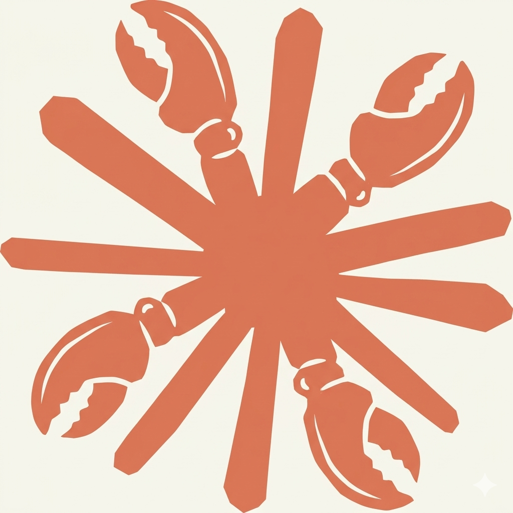

# claudeclaw-container-unraid

<p align="center">
  
</p>

[](https://github.com/paulmeier/claudeclaw-container-unraid/actions/workflows/lint.yml)
[](https://github.com/paulmeier/claudeclaw-container-unraid/actions/workflows/ci.yml)
[](https://github.com/paulmeier/claudeclaw-container-unraid/releases)

Unraid Community Applications template for [claudeclaw-container](https://github.com/paulmeier/claudeclaw-container) — a Docker container running [claudeclaw](https://github.com/moazbuilds/claudeclaw) as a persistent Claude Code personal assistant daemon.

## Template

- **Container image**: `ghcr.io/paulmeier/claudeclaw-container:latest`
- **Project**: https://github.com/paulmeier/claudeclaw-container
- **Container registry**: https://github.com/paulmeier/claudeclaw-container/pkgs/container/claudeclaw-container

## Installation

### Via Community Applications (recommended)

Search for **claudeclaw** in the Unraid Apps tab.

To add this repository as a template source manually:

1. In Unraid, open the **Apps** tab and go to **Settings**.
2. Under **Template Repositories**, add:
   ```
   https://github.com/paulmeier/claudeclaw-container-unraid
   ```
3. Click **Check for Updates**, then search for **claudeclaw**.

### Manual installation

1. In Unraid, go to **Docker** → **Add Container**.
2. Click **Load template from URL** and paste:
   ```
   https://raw.githubusercontent.com/paulmeier/claudeclaw-container-unraid/main/templates/claudeclaw-container.xml
   ```
3. Click **Load**, fill in any required fields, and click **Apply**.

## First-run authentication

claudeclaw uses your Claude Code subscription — no API key needed. After the container starts for the first time, open a terminal to it and run:

```bash
claude login
```

This opens an OAuth browser flow. Complete it once and credentials are saved permanently in the app data volume.

## Configuration

Edit `settings.json` in your app data directory (`/mnt/user/appdata/claudeclaw/claudeclaw/settings.json`) to configure messaging bridges and other options. Use [settings.example.json](https://github.com/paulmeier/claudeclaw-container/blob/main/settings.example.json) as a starting point.

## Tailscale

The template supports Unraid's Community Applications Tailscale integration. To enable it:

1. Open the claudeclaw container in **Docker** and switch to **Advanced View**.
2. Toggle **Use Tailscale** on and fill in the standard Tailscale fields (hostname, exit node, etc.).
3. Apply.

The template pre-declares `CA_TS_FALLBACK_DIR=/root/.claude/tailscale`, so Tailscale's state (machine key, node info) lands inside the persistent appdata volume at `/mnt/user/appdata/claudeclaw/tailscale/` and survives container recreation and image updates. Without this, Unraid's Tailscale hook errors with `Couldn't detect persistent Docker directory for .tailscale_state!` because it can't auto-recognize `/root/.claude` as a config path.

## Support

Open an issue: https://github.com/paulmeier/claudeclaw-container-unraid/issues
